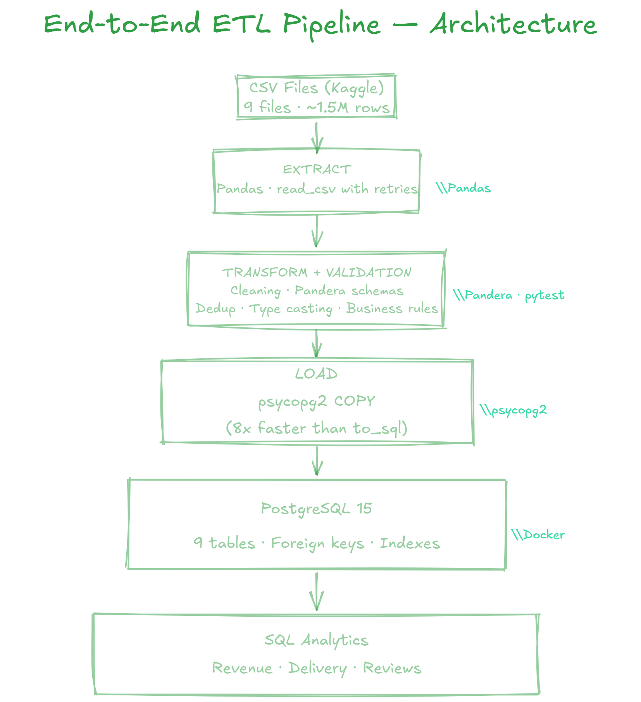
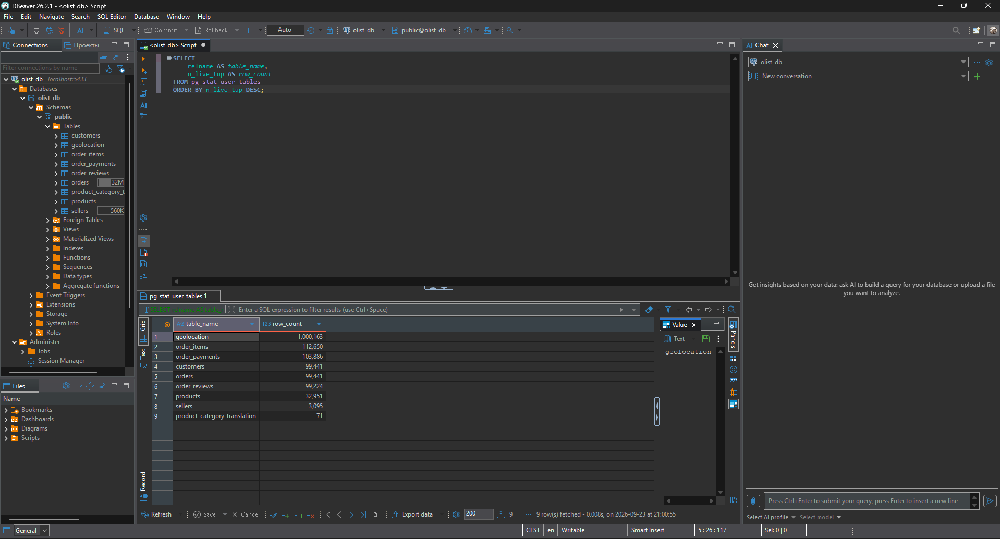
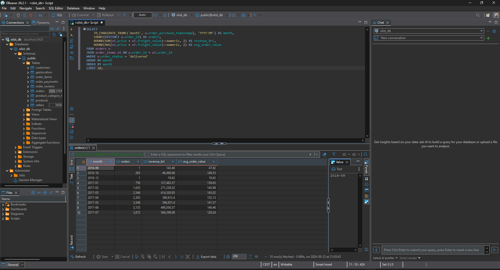
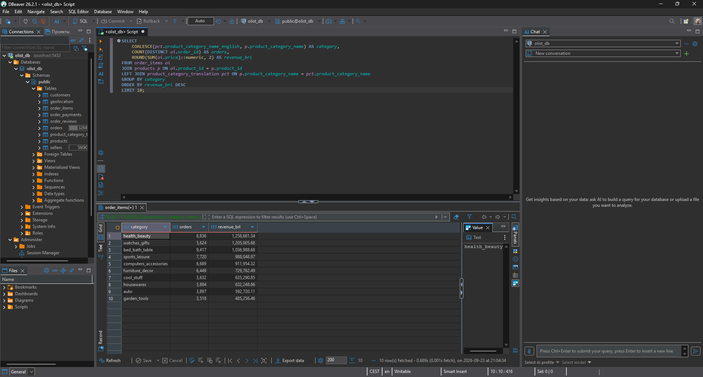

# End-to-End ETL Pipeline with Python and PostgreSQL


A production-ready ETL pipeline that extracts e-commerce data from CSV files,
validates and transforms it with Pandas and Pandera, and loads it into PostgreSQL
using the high-performance `COPY` protocol.

Built as a portfolio project demonstrating real-world data engineering practices:
modular code, data validation, error handling with retries, structured logging,
unit tests, and Docker-based reproducibility.

---

## What problem does it solve?

Raw e-commerce data is scattered across multiple CSV files, full of duplicates,
missing values, and type inconsistencies. Business analysts cannot answer simple
questions like:

- What is our monthly revenue?
- Which product categories sell best?
- What is the average delivery time per region?

This pipeline automates the entire process: it extracts data, cleans it, validates it
against schemas, loads it into a relational database, and makes it ready for SQL analytics.

---

## Architecture

```
┌─────────────────┐
│  CSV (Kaggle)   │  ← 9 files, ~1.5M rows
└────────┬────────┘
         │
         ▼
┌─────────────────┐
│  EXTRACT        │  Pandas: read_csv with retries
└────────┬────────┘
         │
         ▼
┌─────────────────┐
│  TRANSFORM      │  Cleaning: dedup, type casting, date parsing
│  + VALIDATION   │  Pandera: schema validation, business rules
└────────┬────────┘
         │
         ▼
┌─────────────────┐
│  LOAD           │  psycopg2 COPY (8x faster than to_sql)
└────────┬────────┘
         │
         ▼
┌─────────────────┐
│  PostgreSQL 15  │  Relational model with foreign keys and indexes
└────────┬────────┘
         │
         ▼
┌─────────────────┐
│  SQL Analytics  │  Revenue, delivery times, customer reviews
└─────────────────┘
```

---
## Architecture



---

## Tech Stack

| Tool | Purpose |
|---|---|
| **Python 3.12** | Core language |
| **Pandas** | Data manipulation |
| **Pandera** | Schema validation |
| **psycopg2** | PostgreSQL driver |
| **PostgreSQL 15** | Target data warehouse |
| **Docker & Compose** | Reproducibility |
| **Tenacity** | Retry logic for transient errors |
| **pytest** | Unit testing |
| **PyYAML** | Configuration management |
| **python-dotenv** | Secrets management |
| **GitHub Actions** | CI/CD |

---

## Project Structure

```
end-to-end-pipeline/
├── .github/workflows/       # GitHub Actions (test automation)
├── config/
│   └── config.yaml          # Declarative table configuration
├── data/raw/                # Source CSV files (not in repo)
├── docs/                    # Architecture diagrams, screenshots
├── logs/                    # Rotating log files (not in repo)
├── sql/
│   ├── 01_init_schema.sql   # DDL: tables, keys, indexes
│   └── 02_analytics.sql     # Business queries
├── src/
│   ├── cli.py               # Command-line interface (argparse)
│   ├── config_loader.py     # YAML + .env config loader
│   ├── extract.py           # EXTRACT step with retries
│   ├── transform.py         # TRANSFORM step (cleaning)
│   ├── validation.py        # Pandera schemas
│   ├── load.py              # LOAD step (PostgreSQL COPY)
│   ├── pipeline.py          # Orchestration
│   └── logging_config.py    # Structured logging
├── tests/
│   ├── conftest.py          # Pytest fixtures
│   └── test_transform.py    # Unit tests
├── Dockerfile
├── docker-compose.yml
├── requirements.txt
└── README.md
```

---

## How to Run

### Prerequisites

- Python 3.12+
- Docker Desktop
- Git

### 1. Clone the repository

```bash
git clone https://github.com/anna1sheludko/end-to-end-pipeline.git
cd end-to-end-pipeline
```

### 2. Download the dataset

Download the [Brazilian E-Commerce Public Dataset by Olist](https://www.kaggle.com/datasets/olistbr/brazilian-ecommerce)
and place all 9 CSV files into `data/raw/`.

### 3. Set up the environment

```bash
python -m venv .venv
source .venv/bin/activate      # Windows: .venv\Scripts\Activate.ps1
pip install -r requirements.txt
```

### 4. Configure environment variables

```bash
cp .env.example .env
# Edit .env with your database credentials
```

> **Note:** This project uses port **5433** for PostgreSQL to avoid conflicts
> with a locally installed PostgreSQL instance (e.g. Odoo) on port 5432.

### 5. Start PostgreSQL

```bash
docker compose up -d postgres
```

### 6. Initialize the schema

```bash
Get-Content sql/01_init_schema.sql | docker exec -i olist_postgres psql -U olist_user -d olist_db
```

### 7. Run the pipeline

```bash
python -m src.cli --log-level INFO
```

Or process a single table:

```bash
python -m src.cli --table orders
```

### 8. Explore the data

```bash
docker exec -it olist_postgres psql -U olist_user -d olist_db
```

Then run any query from `sql/02_analytics.sql`.

---

## Example Results

### Tables loaded

| Table | Rows |
|---|---|
| customers | 99,441 |
| orders | 99,441 |
| order_items | 112,650 |
| products | 32,951 |
| sellers | 3,095 |
| order_payments | 103,886 |
| order_reviews | 99,224 |
| geolocation | 1,000,163 |
| product_category_translation | 71 |
| **Total** | **1,551,822** |

### Pipeline performance

- **9 tables** loaded
- **1,551,822 rows** total
- **~40 seconds** end-to-end
- **8x faster** load with `COPY` vs `to_sql`

### Sample analytics query — monthly revenue

```sql
SELECT
    TO_CHAR(DATE_TRUNC('month', o.order_purchase_timestamp), 'YYYY-MM') AS month,
    COUNT(DISTINCT o.order_id) AS orders,
    ROUND(SUM(oi.price + oi.freight_value)::numeric, 2) AS revenue
FROM orders o
JOIN order_items oi ON o.order_id = oi.order_id
WHERE o.order_status = 'delivered'
GROUP BY month
ORDER BY month;
```

---
## Example Results

### Tables loaded



### Monthly revenue



### Top product categories



### Pipeline performance

- **9 tables** loaded
- **1,551,822 rows** total
- **~40 seconds** end-to-end
- **8x faster** load with `COPY` vs `to_sql`
---

## Testing

```bash
pytest tests/ -v
```

Unit tests cover:

- Duplicate removal
- Date type conversion
- Derived columns (`is_late`, `delivery_days`)

GitHub Actions runs the test suite on every push.

---

## What This Project Demonstrates

- **Modular ETL design** — separate extract / transform / load steps
- **Data validation** — Pandera schemas with business rules
- **Error handling** — retries via Tenacity, structured exceptions
- **Performance optimization** — `COPY` protocol instead of `to_sql`
- **Production practices** — structured logging with rotation, secrets in `.env`
- **Configuration management** — YAML for declarative setup
- **CLI interface** — argparse with subcommands and flags
- **Testing** — pytest fixtures, unit tests, CI
- **Reproducibility** — Docker for both PostgreSQL and the app
- **SQL analytics** — real business queries, not just toy examples

---
---

## 📄 Case Study

Read the full business case study: [CASE_STUDY.md](CASE_STUDY.md)

---

## License

MIT — see [LICENSE](LICENSE) for details.

---

## Author

**Anna Sheludko**

- GitHub: [@anna1sheludko](https://github.com/anna1sheludko)
- Email: annasheludko152@gmail.com